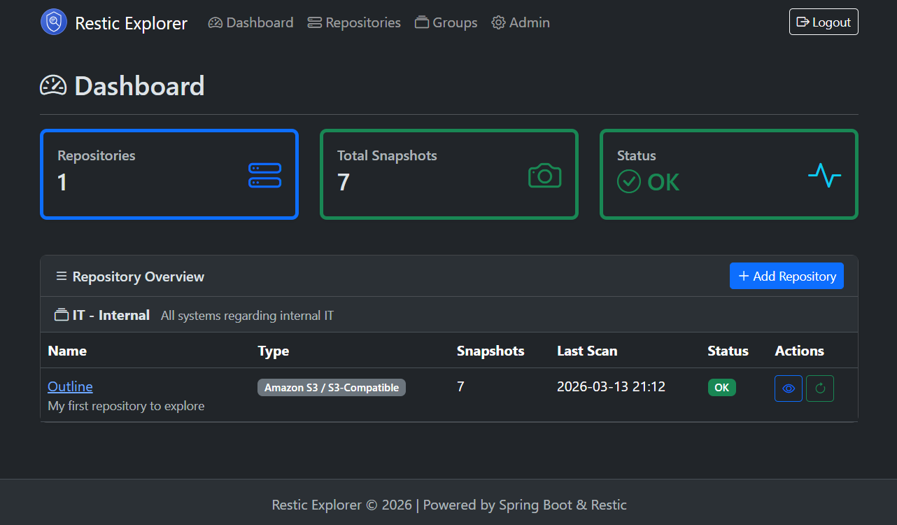
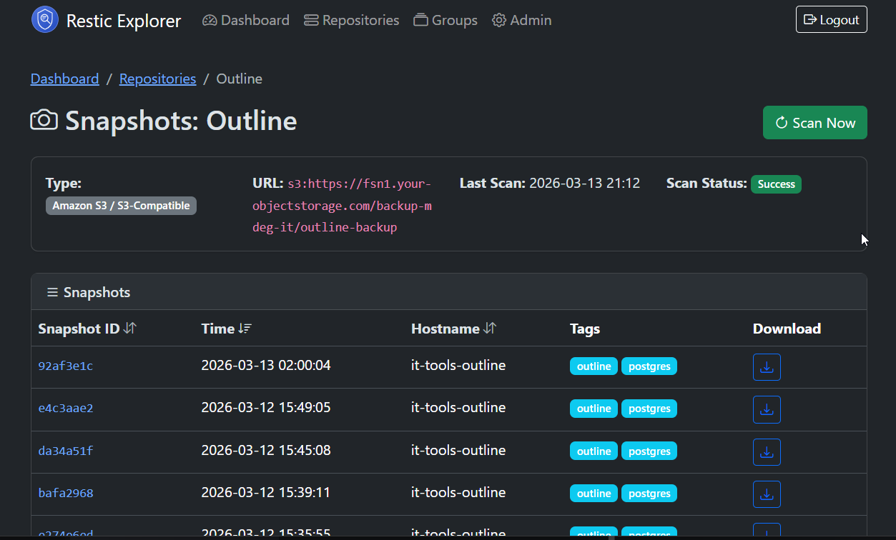
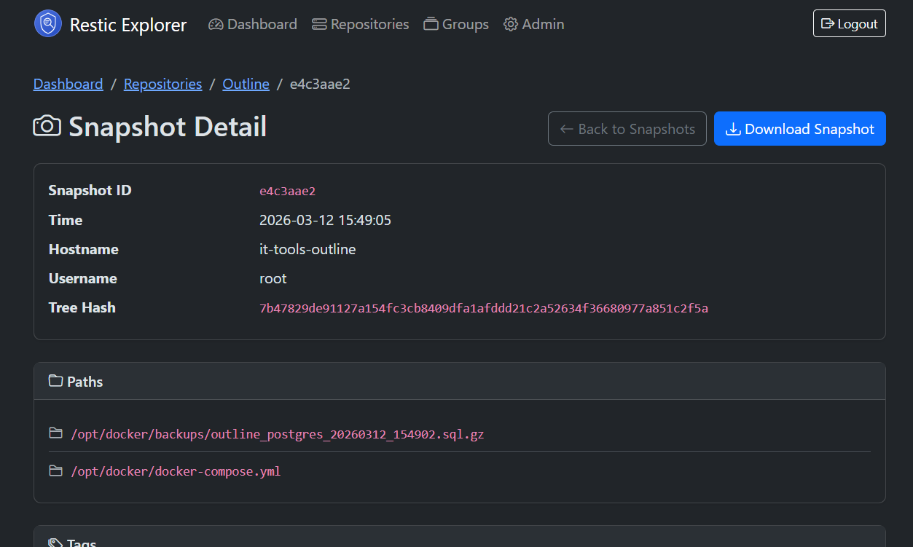

# Restic Explorer


A web-based dashboard for managing and exploring [restic](https://restic.net/) backup repositories. Built with Spring Boot, Thymeleaf, and Bootstrap 5.

## Features

- **Repository Management** – CRUD operations for restic backup repositories (S3 supported, extensible architecture for future backends)
- **Automated Scanning** – Configurable scheduled scans to cache restic metadata
- **Dashboard** – Overview of all repositories, snapshot counts, and scan status
- **Snapshot Browser** – View all snapshots with details (hostname, paths, tags, timestamps)
- **Snapshot Download** – Admin-only download of specific snapshots as tar archives
- **Single Admin Account** – Simple authentication with password setup on first launch
- **Encrypted Sensitive Data** – Repository passwords and S3 credentials encrypted at rest using AES-256-GCM
- **Health Monitoring** – Spring Actuator endpoint reporting restic metadata cache status
- **Internationalization** – All UI text externalized via message bundles; add new languages by adding `messages_xx.properties`
- **Responsive UI** – Modern, mobile-friendly design using Bootstrap 5 and Thymeleaf

## Screenshots
### Dashboard
The dashboard provides a high-level overview of all configured repositories, including the total number of snapshots and the status of the last scan (OK, Failed, Pending). Admins can quickly navigate to the snapshot browser or trigger a manual scan.

### Snapshot Browser
The snapshot browser lists all cached snapshots for a selected repository, showing key details such as snapshot ID, timestamp, hostname, paths, and tags. Admins can trigger a re-scan or download specific snapshots directly from this interface.

### Snapshot Details
Clicking on a snapshot opens a detailed view with all metadata and a download option (admin only) for that snapshot.


## Quick Start

### Prerequisites

- Java 21+
- Maven 3.8+
- [restic](https://restic.readthedocs.io/en/stable/020_installation.html) installed on the system

### Run Locally

```bash
# Clone the repository
git clone https://github.com/tmseidel/restic-explorer.git
cd restic-explorer

# Build and run
mvn spring-boot:run
```

The application starts on [http://localhost:8080](http://localhost:8080). On first launch, you will be redirected to the setup page to create the admin account.

### Run with Docker

```bash
# Build and start with Docker Compose (includes PostgreSQL)
docker compose up --build -d
```

The application will be available at [http://localhost:8080](http://localhost:8080).

### Run with Docker Hub Image

A pre-built image is available on Docker Hub at [`tmseidel/restic-explorer`](https://hub.docker.com/r/tmseidel/restic-explorer).

Create a `docker-compose.yml`:

```yaml
services:
  app:
    image: tmseidel/restic-explorer:latest
    ports:
      - "8080:8080"
    environment:
      SPRING_PROFILES_ACTIVE: docker
      DB_HOST: db
      DB_PORT: 5432
      DB_NAME: resticexplorer
      DB_USER: resticexplorer
      DB_PASSWORD: resticexplorer
      RESTIC_ENCRYPTION_KEY: # optional, generate with: openssl rand -base64 32
    depends_on:
      db:
        condition: service_healthy
    restart: unless-stopped
    volumes:
      - app-data:/app/data

  db:
    image: postgres:16-alpine
    environment:
      POSTGRES_DB: resticexplorer
      POSTGRES_USER: resticexplorer
      POSTGRES_PASSWORD: resticexplorer
    volumes:
      - db-data:/var/lib/postgresql/data
    healthcheck:
      test: ["CMD-SHELL", "pg_isready -U resticexplorer"]
      interval: 10s
      timeout: 5s
      retries: 5
    restart: unless-stopped

volumes:
  app-data:
  db-data:
```

Then start it:

```bash
docker compose up -d
```

The application will be available at [http://localhost:8080](http://localhost:8080).

## User Guide

### 1. Initial Setup

On first launch, you are redirected to the **Setup** page:
1. Enter and confirm an admin password (minimum 8 characters)
2. Click **Create Admin Account**
3. Log in with username `admin` and the password you just set

### 2. Adding a Repository

1. Log in as admin
2. Navigate to **Repositories** → **Add Repository**
3. Fill in the form:
   - **Name**: A friendly display name
   - **Repository Type**: Select S3 (more types planned)
   - **Repository URL**: The restic repository URL, e.g. `s3:https://s3.amazonaws.com/my-bucket/restic-repo`
   - **Repository Password**: The encryption password for the restic repository
   - **S3 Access Key / Secret Key / Region**: Your AWS or S3-compatible credentials
   - **Scan Interval**: How often (in minutes) to automatically scan
4. Click **Save**

### 3. Dashboard

The dashboard shows:
- Total number of repositories and snapshots
- Per-repository scan status (OK, Failed, Pending)
- Quick actions to view snapshots or trigger a manual scan

### 4. Browsing Snapshots

Click on a repository name or the eye icon to see all cached snapshots:
- Snapshot ID, timestamp, hostname, paths, and tags
- Admins can trigger a re-scan or download a snapshot

### 5. Downloading Snapshots

> **Admin only**: Only logged-in admins can download snapshots.

Click the download icon next to any snapshot to download it as a `.tar` archive via `restic dump`.

### 6. Administration

Navigate to **Admin** to:
- Change the admin password
- View system information and actuator health link

### 7. Health & Monitoring

The application exposes Spring Actuator endpoints:

| Endpoint | Description |
|---|---|
| `GET /actuator/health` | Application health including restic metadata status |
| `GET /actuator/info` | Application information |
| `GET /actuator/metrics` | Application metrics |

The custom `resticMetadata` health indicator reports:
- Total repositories and cached snapshots
- Per-repository scan status and last scan time
- Overall status: UP (all scans successful), DOWN (any scan failed), UNKNOWN (no repositories)

## Configuration

### Application Properties

| Property | Default | Description |
|---|---|---|
| `server.port` | `8080` | Server port |
| `restic.binary` | `restic` | Path to the restic binary |
| `restic.timeout` | `300` | Timeout in seconds for restic commands |
| `restic.scan.check-interval` | `60000` | Interval in ms to check for due scans |
| `restic.encryption.key` | *(empty)* | Base64-encoded AES key for encrypting sensitive data at rest (16/24/32 bytes) |

### Encryption of Sensitive Data

Repository passwords and S3 credentials (access key, secret key) are encrypted at rest in the database using AES-GCM when an encryption key is configured.

**Generate a key:**

```bash
openssl rand -base64 32
```

**Configure via environment variable (recommended):**

```bash
export RESTIC_ENCRYPTION_KEY="your-generated-base64-key"
```

Or set in `application.properties`:

```properties
restic.encryption.key=your-generated-base64-key
```

> ⚠️ **Important**: Without an encryption key, sensitive data is stored in plain text. Always configure encryption in production.
> 
> The system gracefully handles legacy unencrypted data — existing plain-text values will be readable even after encryption is enabled, and will be encrypted upon the next save.

### Docker Environment Variables

| Variable | Default | Description |
|---|---|---|
| `DB_HOST` | `db` | PostgreSQL host |
| `DB_PORT` | `5432` | PostgreSQL port |
| `DB_NAME` | `resticexplorer` | Database name |
| `DB_USER` | `resticexplorer` | Database user |
| `DB_PASSWORD` | `resticexplorer` | Database password |
| `RESTIC_ENCRYPTION_KEY` | *(empty)* | Base64-encoded AES key for encrypting sensitive data at rest |

## Deployment

### Docker Compose

The included `docker-compose.yml` runs the application with PostgreSQL:

```bash
docker compose up --build -d
```

### Ansible

An Ansible playbook is provided in `deploy/ansible/`:

```bash
cd deploy/ansible
ansible-playbook -i inventory.ini deploy.yml
```

Edit `inventory.ini` to point to your target server.

## Development

### Build

```bash
mvn clean package
```

### Run Tests

```bash
mvn test
```

### Project Structure

```
src/main/java/org/remus/resticexplorer/
├── ResticExplorerApplication.java     # Main application entry point
├── config/                            # Security, web config & encryption
│   ├── crypto/                        # AES-GCM encryption service & converter
│   └── exception/                     # Custom exceptions & global handler
├── admin/                             # Admin feature (auth, setup)
│   ├── web/                           # Controllers, DTOs
│   ├── data/                          # JPA entities, repositories
│   └── AdminService.java             # Service layer
├── repository/                        # Repository management feature
│   ├── web/                           # Controllers, DTOs
│   ├── data/                          # JPA entities, repositories
│   └── RepositoryService.java        # Service layer
├── scanning/                          # Scanning & metadata feature
│   ├── web/                           # Dashboard controller
│   ├── data/                          # Snapshot, ScanResult entities
│   └── ScanService.java              # Scheduled scanning service
├── download/                          # Snapshot download feature
│   └── web/                           # Download controller
├── restic/                            # Restic CLI integration
│   ├── ResticRepositoryProvider.java  # Provider interface (extensible)
│   ├── ResticS3Provider.java          # S3 implementation
│   └── ResticCommandService.java      # Command execution service
└── health/                            # Actuator health indicator
    └── ResticMetadataHealthIndicator.java
```

## License

[MIT License](LICENSE)
