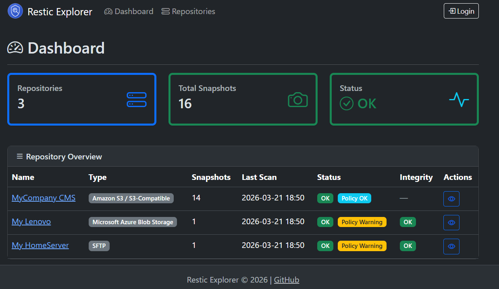
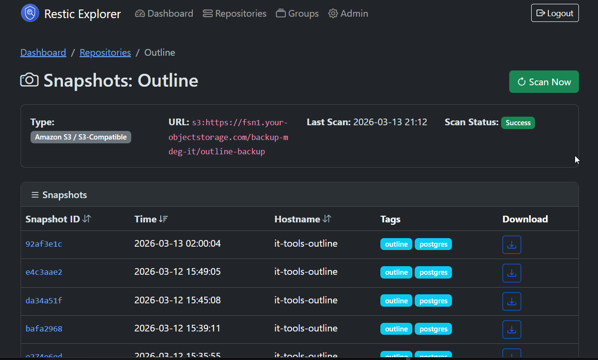
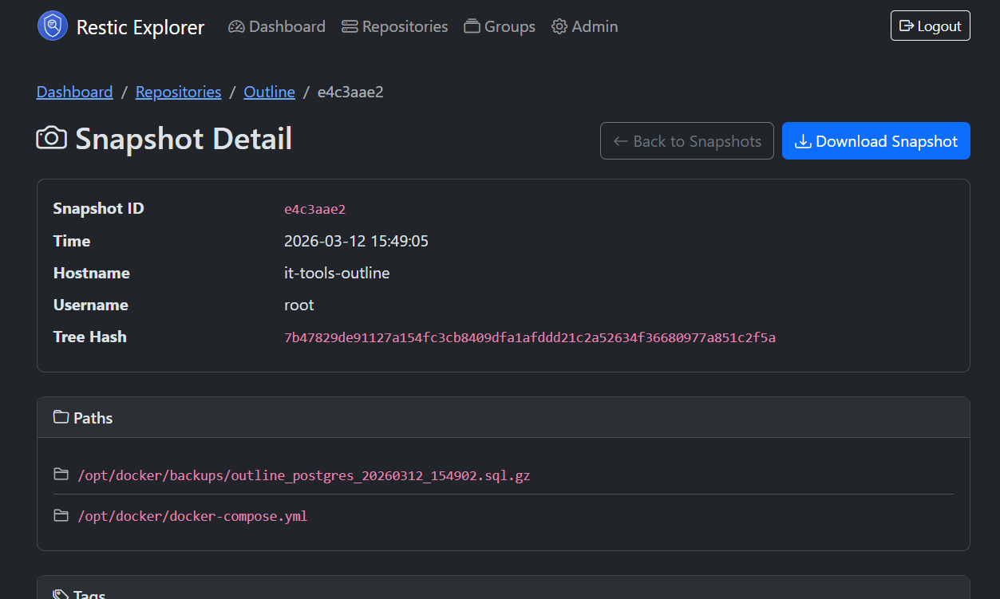

# Restic Explorer

[](https://github.com/tmseidel/restic-explorer/actions/workflows/ci.yml)
[](https://github.com/tmseidel/restic-explorer/actions/workflows/docker-publish.yml)
[](https://hub.docker.com/r/tmseidel/restic-explorer)
[](LICENSE)

A lightweight monitoring interface for [restic](https://restic.net/) backup repositories, built to feed status and health data into observability solutions such as Grafana, Prometheus, or Uptime Kuma. It includes its own dashboard UI for browsing repositories and snapshots, but its primary purpose is to expose reliable, queryable backup health signals to external monitoring systems. Built with Spring Boot 4, Thymeleaf, and Bootstrap 5.



## Key Features

- **Observability-First Health Signals** — `/actuator/health` exposes per-repository scan, integrity-check, and retention status for easy integration with Grafana, Prometheus, Uptime Kuma, or any HTTP-monitoring tool
- **Multi-Repository Dashboard** — browse all your restic repos in one place with status badges, groups, and lock warnings
- **Automated Scanning & Integrity Checks** — scheduled `restic snapshots` and `restic check --read-data`
- **Retention Policies** — advisory daily/weekly/monthly/yearly rules with amber violation warnings
- **Encrypted Credentials** — AES-256-GCM at rest for passwords and backend keys
- **Dark Mode & Responsive UI** — Bootstrap 5.3 with automatic light/dark theme

## Supported Backends

| Backend | URL Format | Details |
|---|---|---|
| **Amazon S3 / S3-Compatible** | `s3:https://s3.amazonaws.com/bucket/path` | Access Key, Secret Key, Region |
| **Azure Blob Storage** | `azure:container:/path` | Account Name, Account Key |
| **SFTP** | `sftp:user@host:/path` | Key-based auth only ([tutorial](docs/SYSTEMTEST_SFTP.md)) |
| **REST Server** | `rest:http://host:8000/` | Optional HTTP basic auth ([tutorial](docs/SYSTEMTEST_REST.md)) |
| **Rclone** | `rclone:remote:path` | Any rclone-supported backend ([tutorial](docs/SYSTEMTEST_RCLONE.md)) |

## Quick Start

### Docker Compose (recommended)

```bash
docker compose up --build -d
```

Open [http://localhost:8080](http://localhost:8080) and create the admin account on first launch.

### Docker Hub

```bash
docker pull tmseidel/restic-explorer:latest
```

See [Configuration → Docker Hub Image](docs/CONFIGURATION.md#docker-hub-image) for a full `docker-compose.yml`.

### Local Development

```bash
mvn spring-boot:run       # Start with H2 file DB
mvn test                  # Run tests (H2 in-memory)
mvn clean package         # Build jar
```

Requires Java 21+ and [restic](https://restic.readthedocs.io/en/stable/020_installation.html) on PATH.

## Querying Backup Health

The main integration point is `GET /actuator/health`. It returns the overall application status and a `resticMetadata` object with per-repository scan, check, and retention information.

### Basic curl checks

```bash
# Overall status (HTTP 200 when healthy, non-200 when any repo failed)
curl -fsS http://localhost:8080/actuator/health | jq .

# Number of healthy vs unhealthy repositories
curl -fsS http://localhost:8080/actuator/health | jq '.components.resticMetadata.details | {healthy: .healthyRepositories, unhealthy: .unhealthyRepositories}'

# Per-repo status for a repository named "nas-backup"
curl -fsS http://localhost:8080/actuator/health | jq '.components.resticMetadata.details."repository_nas-backup"'
```

### Common jq filters

```bash
# List every repository and its last scan/check status
curl -fsS http://localhost:8080/actuator/health | jq '.components.resticMetadata.details | to_entries[] | select(.key | startswith("repository_")) | {name: .key, scan: .value.lastScanStatus, check: .value.lastCheckStatus, retentionOK: .value.retentionPolicyFulfilled}'

# Show only repositories with scan or check failures
curl -fsS http://localhost:8080/actuator/health | jq '.components.resticMetadata.details | to_entries[] | select(.key | startswith("repository_")) | select(.value.lastScanStatus == "FAILED" or .value.lastCheckStatus == "FAILED")'

# Count total repositories and cached snapshots
curl -fsS http://localhost:8080/actuator/health | jq '.components.resticMetadata.details | {repos: .totalRepositories, snapshots: .totalCachedSnapshots}'
```

### Integrations

- **Uptime Kuma / simple HTTP monitor** — monitor `http://localhost:8080/actuator/health`. The endpoint returns HTTP 503 when any repository scan or integrity check has failed.
- **Prometheus** — scrape `/actuator/prometheus` (if enabled) or use the [JSON exporter](https://github.com/prometheus-community/json_exporter) against `/actuator/health` to turn `healthyRepositories` / `unhealthyRepositories` into metrics.
- **Grafana** — use the [Infinity](https://grafana.com/grafana/plugins/yesoreyeram-infinity-datasource/) or [JSON API](https://grafana.com/grafana/plugins/marcusolsson-json-datasource/) datasource to query `/actuator/health` and build per-repo health panels.

See [Configuration](docs/CONFIGURATION.md) for enabling `/actuator/prometheus` and securing actuator access.

## Screenshots

| Dashboard | Snapshots | Snapshot Detail |
|---|---|---|
|  |  |  |

## Documentation

| Document | Description |
|---|---|
| [User Guide](docs/USER_GUIDE.md) | Setup, adding repositories, browsing snapshots, retention policies |
| [Configuration](docs/CONFIGURATION.md) | Properties, Docker env vars, encryption, deployment, migration |
| [Architecture](docs/ARCHITECTURE.md) | System design, data model, extensibility, technology stack |
| [SFTP Testing](docs/SYSTEMTEST_SFTP.md) | SFTP backend setup tutorial |
| [REST Server Testing](docs/SYSTEMTEST_REST.md) | REST server backend setup tutorial |
| [Rclone Testing](docs/SYSTEMTEST_RCLONE.md) | Rclone backend setup tutorial |
| [Contributing](CONTRIBUTING.md) | How to contribute |
| [Code of Conduct](CODE_OF_CONDUCT.md) | Community guidelines |

## License

[MIT](LICENSE) — © 2026 Tom Seidel

