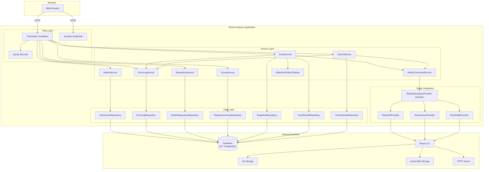
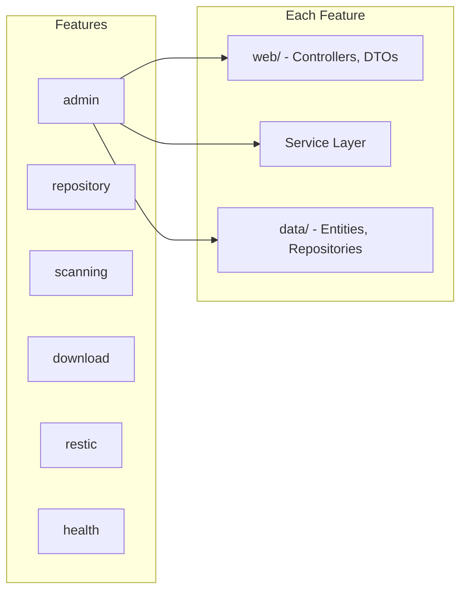
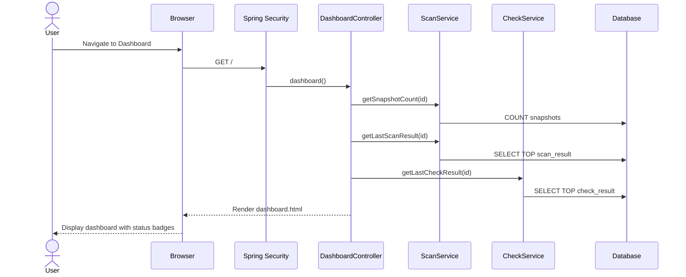
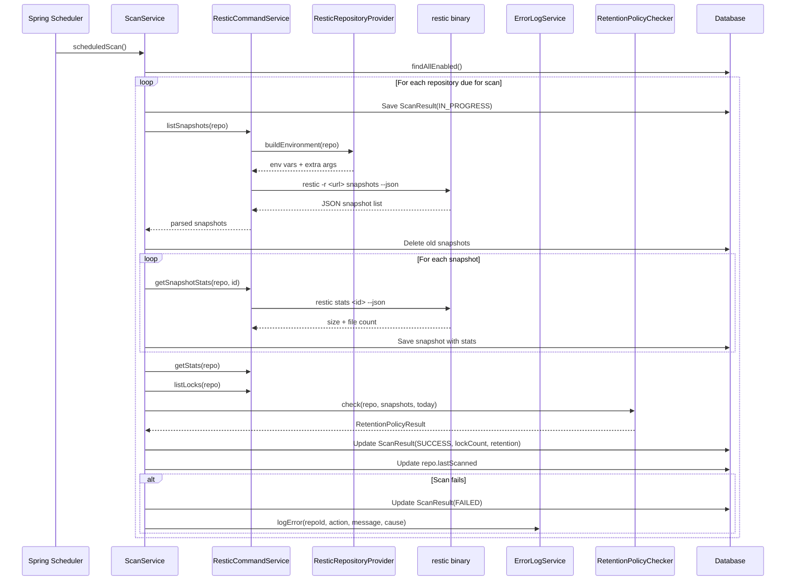
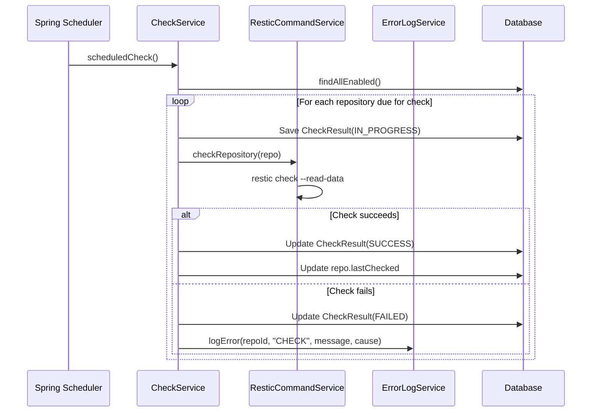
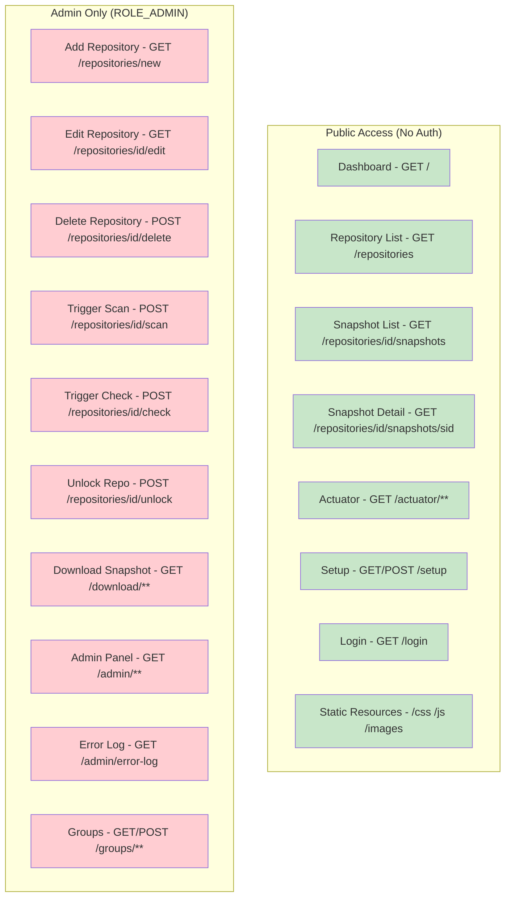
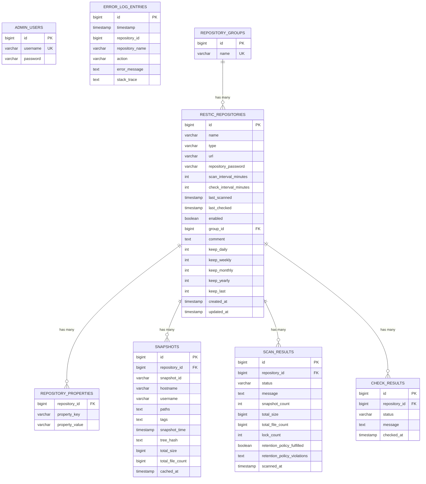
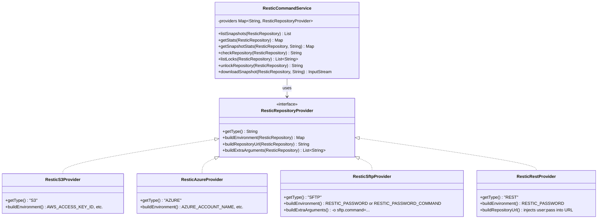
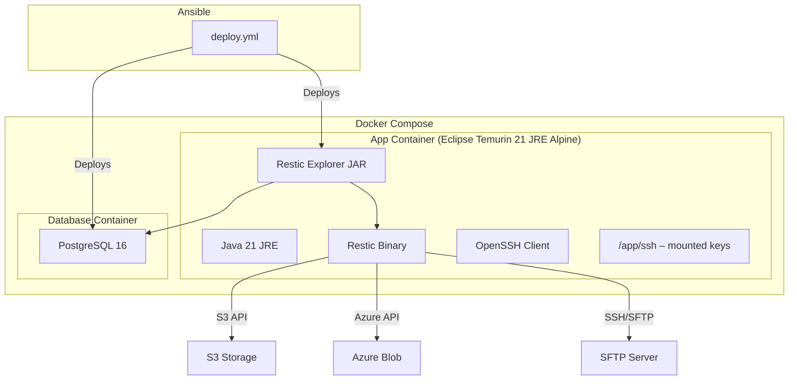

# Architecture Documentation

## Overview

Restic Explorer is a Spring Boot 4 web application that provides a monitoring dashboard for restic backup repositories. It caches repository metadata in a database, provides automated scanning and integrity checking, and surfaces status through a web UI and health endpoints.

## System Architecture

## Component Architecture

## Package Structure

The application follows a **feature-based package structure**:

| Package | Purpose |
|---|---|
| `o.r.r.admin` | Admin authentication, setup, password management, error log |
| `o.r.r.repository` | Restic repository CRUD, groups, properties |
| `o.r.r.scanning` | Scheduled scanning, integrity checks, retention policies, dashboard |
| `o.r.r.download` | Snapshot download (admin-only) |
| `o.r.r.restic` | Restic CLI integration, backend provider abstraction |
| `o.r.r.health` | Actuator health indicator |
| `o.r.r.config` | Security, web config, encryption, schema migration, utilities |

Each feature package contains up to three sub-packages:
- `web/` – Controllers, DTOs, form objects
- `data/` – JPA entities, Spring Data repositories
- Root package – Service classes

## Request Flow

## Scanning Flow

## Integrity Check Flow

## Security Model

## Data Model

## Extensibility: Adding New Repository Types

The restic integration uses the **Strategy Pattern** via the `ResticRepositoryProvider` interface:

To add a new repository type:

1. Add a new value to `RepositoryType` enum
2. Add any backend-specific keys to `RepositoryPropertyKey` enum
3. Create a new `ResticRepositoryProvider` implementation annotated with `@Component`
4. Update the UI form template to show type-specific fields
5. If using PostgreSQL, the `SchemaFixRunner` will automatically reconcile check constraints

## Backend Properties Architecture

Backend-specific configuration (S3 keys, Azure credentials, SFTP commands) is stored as a `Map<RepositoryPropertyKey, String>` on `ResticRepository`, persisted in a separate `repository_properties` table. Sensitive properties (marked via `RepositoryPropertyKey.isSensitive()`) are encrypted/decrypted manually in `RepositoryService` using `EncryptionService`.

| Backend | Property Keys | Sensitive |
|---|---|---|
| S3 | `S3_ACCESS_KEY`, `S3_SECRET_KEY`, `S3_REGION` | Access Key, Secret Key |
| Azure | `AZURE_ACCOUNT_NAME`, `AZURE_ACCOUNT_KEY`, `AZURE_ENDPOINT_SUFFIX` | Account Key |
| SFTP | `SFTP_PASSWORD_COMMAND`, `SFTP_COMMAND` | None |
| REST | `REST_USERNAME`, `REST_PASSWORD` | Password |

## UI Architecture

- **Layout**: Thymeleaf fragment-based layout (`fragments/layout.html`) with navbar, footer, and shared head
- **Dark Mode**: Auto-detected via `prefers-color-scheme` media query, applied via Bootstrap 5.3 `data-bs-theme`
- **Pagination**: Reusable Thymeleaf fragment (`fragments/pagination.html`) with sortable headers and page controls
- **Internationalization**: All text from `messages.properties`; add `messages_xx.properties` for new locales
- **Templates**: Follow controller path convention — `scanning/dashboard`, `scanning/snapshots`, `scanning/snapshot-detail`, `repository/form`, `admin/index`, `admin/error-log`, `group/list`

## Deployment Architecture

## Technology Stack

| Component | Technology |
|---|---|
| Backend Framework | Spring Boot 4.0 |
| Template Engine | Thymeleaf |
| CSS Framework | Bootstrap 5.3 |
| Icons | Bootstrap Icons |
| Database (dev) | H2 (file-based) |
| Database (prod) | PostgreSQL 16 |
| ORM | Spring Data JPA / Hibernate 7 |
| Security | Spring Security 7 |
| Monitoring | Spring Actuator |
| Build Tool | Maven |
| Code Generation | Lombok |
| Containerization | Docker (multi-stage build) |
| Deployment | Docker Compose, Ansible |
| Backup Tool | Restic CLI |

## Schema Migration

The `SchemaFixRunner` (in `config/`) runs on startup to reconcile Hibernate-generated check constraints on PostgreSQL for `@Enumerated(STRING)` columns. When new enum values are added (e.g. a new `RepositoryType` or `RepositoryPropertyKey`), `ddl-auto=update` does not update existing constraints. The runner replaces stale constraints with current values. This will be removed in version 1.0.

