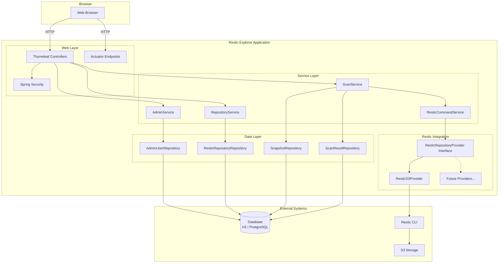
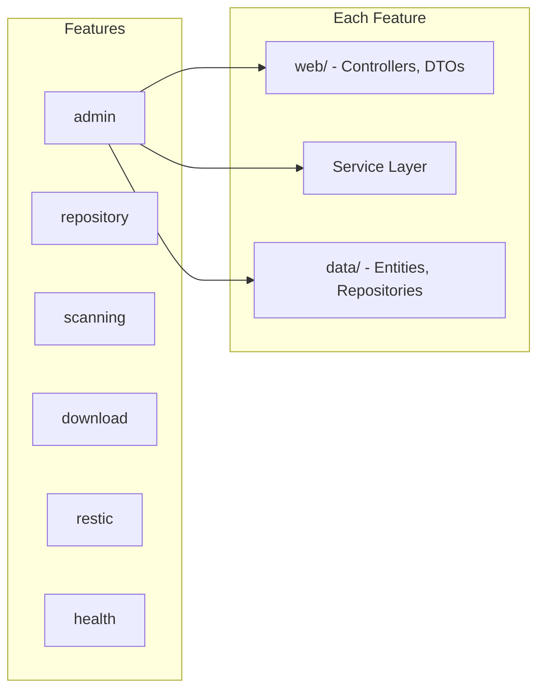
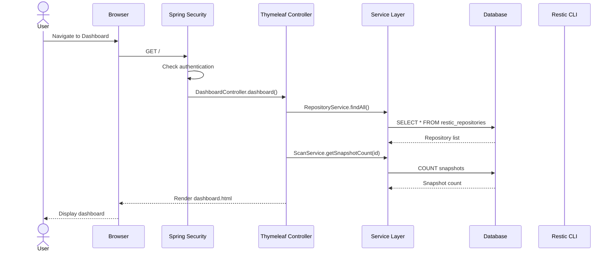
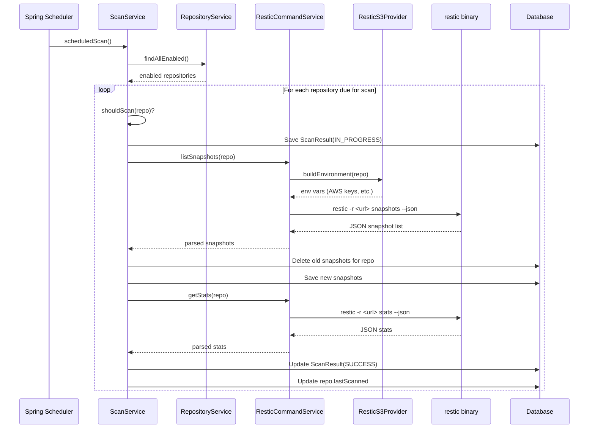
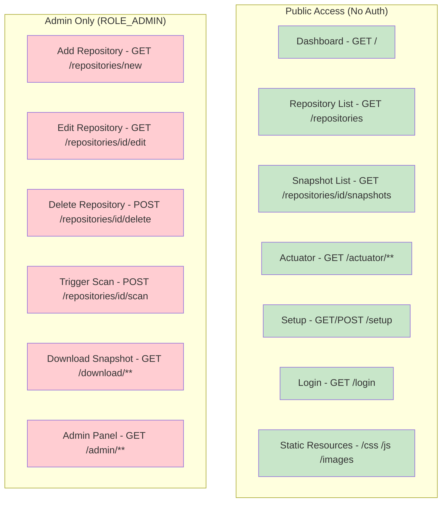
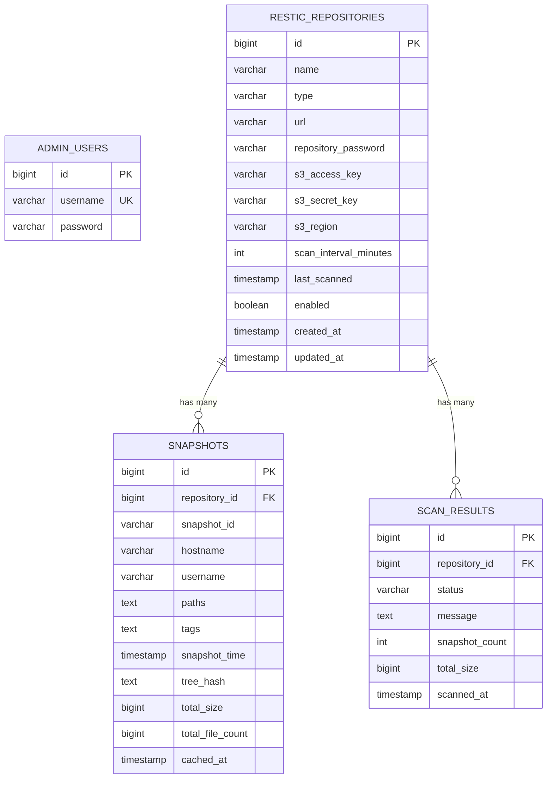
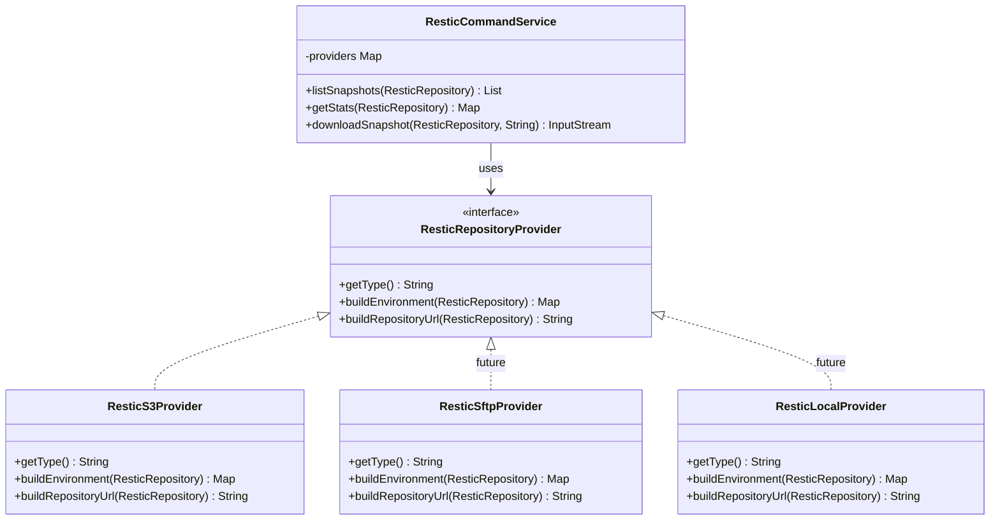
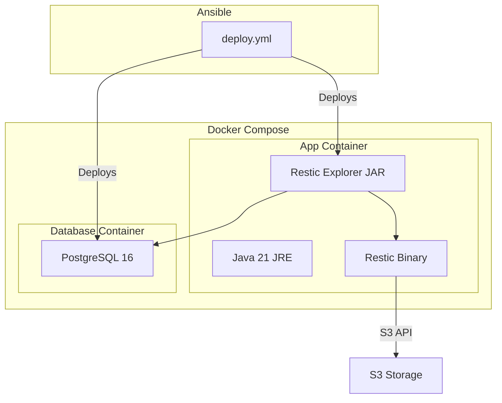

# Architecture Documentation

## Overview

Restic Explorer is a Spring Boot web application that provides a dashboard for managing and browsing restic backup repositories. It caches repository metadata in a lightweight database and offers both automated and manual scanning capabilities.

## System Architecture

## Component Architecture

## Package Structure

The application follows a **feature-based package structure**:

| Package | Purpose |
|---|---|
| `org.remus.resticexplorer.admin` | Admin authentication, setup, password management |
| `org.remus.resticexplorer.repository` | Restic repository CRUD management |
| `org.remus.resticexplorer.scanning` | Scheduled scanning, metadata caching, dashboard |
| `org.remus.resticexplorer.download` | Snapshot download (admin-only) |
| `org.remus.resticexplorer.restic` | Restic CLI integration, provider abstraction |
| `org.remus.resticexplorer.health` | Actuator health indicator |
| `org.remus.resticexplorer.config` | Security and web configuration |

Each feature package contains up to three sub-packages:
- `web/` – Controllers, DTOs, form objects
- `data/` – JPA entities, Spring Data repositories
- Root package – Service classes

## Request Flow

## Scanning Flow

## Security Model

## Data Model

## Extensibility: Adding New Repository Types

The restic integration is built on the **Strategy Pattern** via the `ResticRepositoryProvider` interface:

To add a new repository type:

1. Add a new value to `RepositoryType` enum
2. Create a new `ResticRepositoryProvider` implementation annotated with `@Component`
3. Add any type-specific fields to the `ResticRepository` entity
4. Update the UI form to show type-specific fields

## Deployment Architecture

## Technology Stack

| Component | Technology |
|---|---|
| Backend Framework | Spring Boot 4.0 |
| Template Engine | Thymeleaf |
| CSS Framework | Bootstrap 5.3 |
| Database (dev) | H2 (file-based) |
| Database (prod) | PostgreSQL 16 |
| ORM | Spring Data JPA / Hibernate |
| Security | Spring Security 7 |
| Monitoring | Spring Actuator |
| Build Tool | Maven |
| Code Generation | Lombok |
| Containerization | Docker, Docker Compose |
| Deployment | Ansible |
| Backup Tool | Restic CLI |
